# Frontend Mentor - Order summary card

The project was based on the challenge provided by [Frontend Mentor](https://www.frontendmentor.io).

This is a solution to the [Order summary card challenge on Frontend Mentor](https://www.frontendmentor.io/challenges/order-summary-component-QlPmajDUj). 

## The design provided

## Table of contents

- [User Stories](#user-stories)
- [Features](#features)
- [Technologies Used](#technologies-used)
- [Design](#design)
- [Bugs](#bugs)
- [Testing](#testing)
  - [Compatibility](#compatibility)
  - [Validator testing](#validator-testing)
  - [Lighthouse Report](#lighthouse-report)
- [Deployment](#deployment)
- [Author](#author)
- [Credits](#credits)
- [Acknowledgments](#acknowledgments)

I was using design files provided for this challenge in order to make the result look as similar as possible to the provided images.

I have also added various breakpoints in order to provide the best user experience.

The solution to this challenge can be accessed by this [link](https://iuliiakonovalova.github.io/frontend_mentor_order-summary-component-main/)

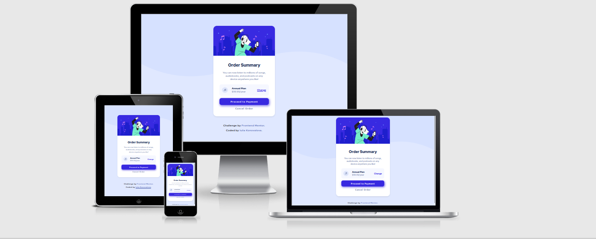

---
## User Stories

### First Time Visitor Goals:

* As a First Time Visitor, I want to easily understand the main purpose of the web page, so I can learn more about this web page.
* As a First Time Visitor, I want to be able to easily navigate through the web page, so I can find the content.
* As a First Time Visitor, I want to find the web page useful.

### Frequent Visitor Goals:
* As a Frequent User, I want to see the changes in payment, so I can easily make a choice.
* As a Frequent User, I want to have different options for payment, so I can make prudent decision about future purchase. 

---

## Features

+ ### Main Page

    - Represent: 

        * Order summary card.

    - Consist:

        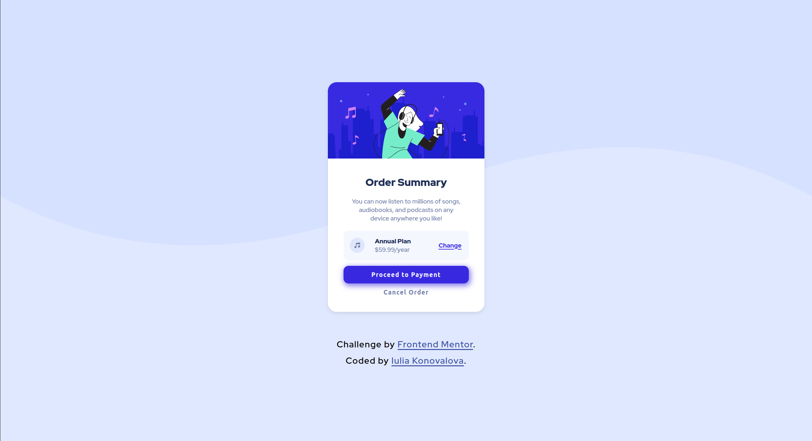

        * Has the main card with order summary for the user.

        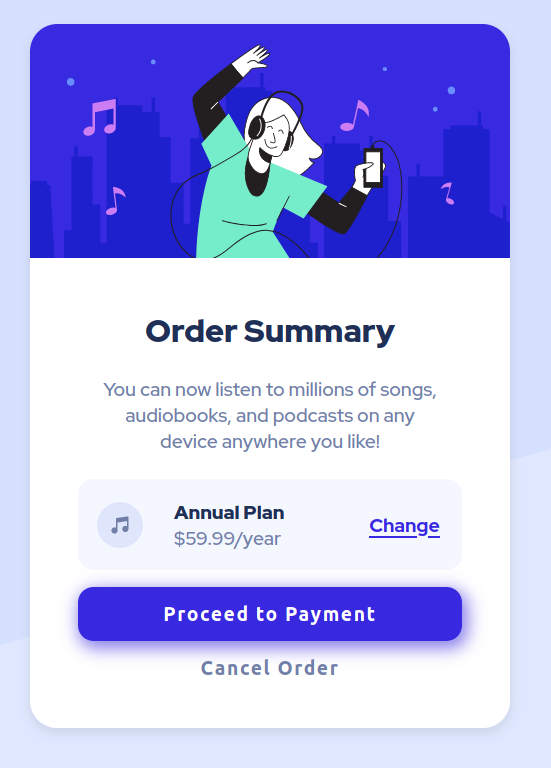

        * Has order related information: title, incentive to proceed the payment, chosen options and 2 buttons.

        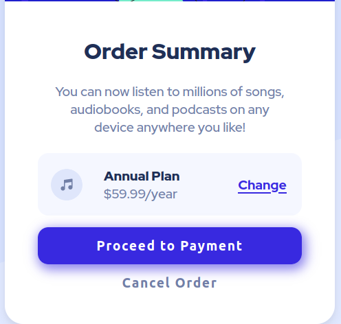

        * Has icon of a product, title of a plan and the price. It also has "Change" button which has an active state.

        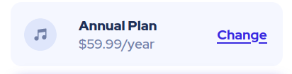

        * Has two buttons: "proceed to payment" and "cancel order", which have active states.

        

        * Has a link to [Frontend Mentor](https://www.frontendmentor.io) website, which provided all images and required design as well as the link to my github account [Iuliia Konovalova](https://github.com/IuliiaKonovalova)

        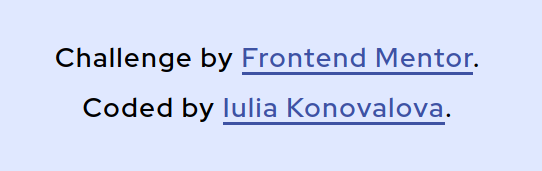

---

## Technologies Used

- [HTML](https://developer.mozilla.org/en-US/docs/Web/HTML) - was used as the foundation of the site.
- [CSS](https://developer.mozilla.org/en-US/docs/Web/css) - was used to add the styles and layout of the site.
- [CSS Flexbox](https://developer.mozilla.org/en-US/docs/Learn/CSS/CSS_layout/Flexbox) - was used to arrange items symmetrically on the pages.
- [CSS Grid](https://developer.mozilla.org/en-US/docs/Web/CSS/grid) - was used to make "gallery" and "contact" pages responsive.
- [CSS roots](https://developer.mozilla.org/en-US/docs/Web/CSS/:root) - was used to declaring global CSS variables and apply them throughout the project. 
- [VSCode](https://code.visualstudio.com/) - was used as the main tool to write and edit code.
- [Git](https://git-scm.com/) - was used for the version control of the website.
- [GitHub](https://github.com/) - was used to host the code of the website.
- [GIMP](https://www.gimp.org/) - was used to make and resize images for the README file.

---

---
## Design

- The color scheme and font-family were provided by [Frontend Mentor](https://www.frontendmentor.io).

- Background Colors:

- Card Background Color:

- Options Background Color:

- Text Color Main:

- Text Color:

- Accent Text Color:

- Payment Button Color:

- Font-family ([Red Hat Display](https://fonts.google.com/specimen/Red+Hat+Display)):

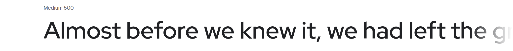

---

## Bugs

+ **Unsolved bugs**

    - None.

---

## Testing

### Compatibility:

+ The app was tested on the following browsers: Chrome, Firefox, Brave, Edge:

  - Chrome:

  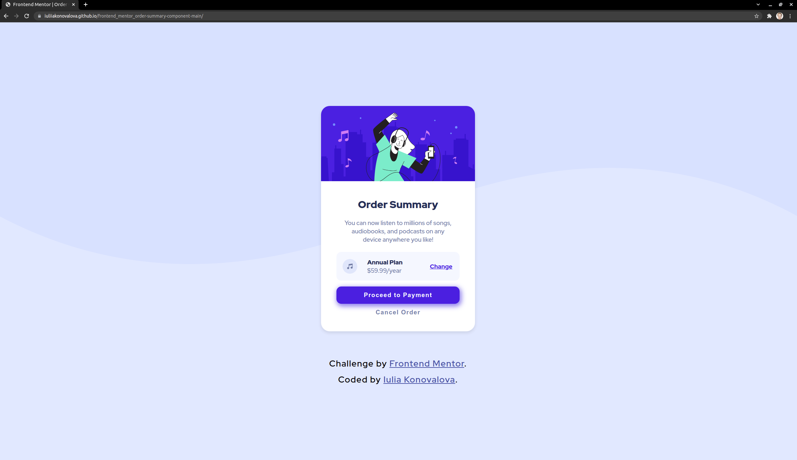
  
  - Firefox:

  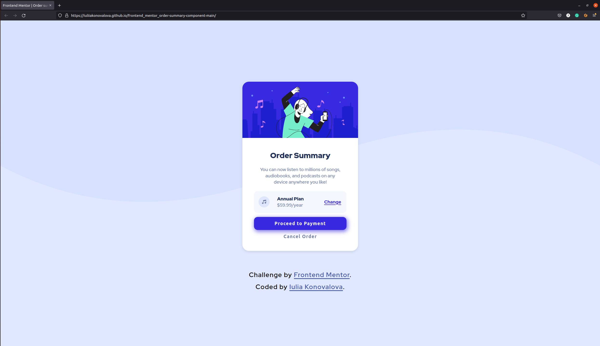

  - Brave:

  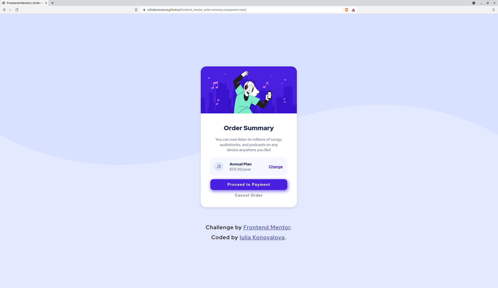

---

+ The app was checked by devtools implemented on Firefox and Chrome browsers.

+ The app was checked with [Responsive Website Design Tester](https://responsivedesignchecker.com/).

  1. Mobile Screens:

    - Mobile 320x480, 320x568, 360x640, 375x667, 384x640, 411x731, 414x736:

     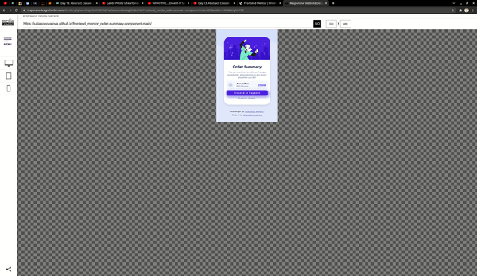

      
  1. Tablets Screens:

    - Tablet 600x960, 768x1024, 800x1280, 1366x1024, 1600x900, 1680x1050, 1920x1080, 1920x1200:
        
    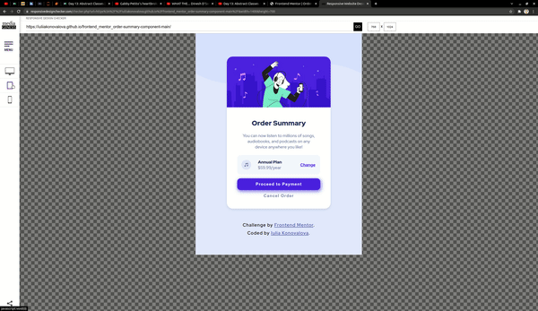
      
  1. Desktop Screens:

    - Desktop 1024x600, 1024x800, 1366x768, 1440x900:
        
    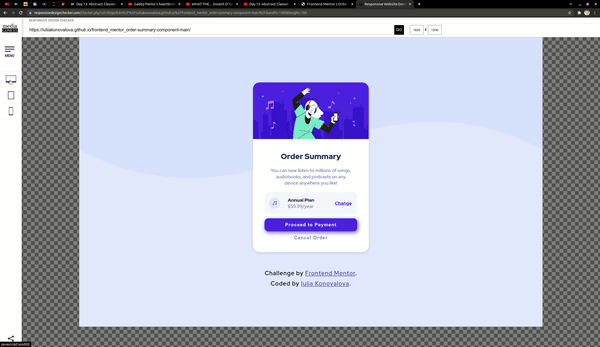

+ The functionality of the links in the app was checked as well by different users.

---
### Validator testing
+ #### HTML
  
  - No errors or warnings were found when passing through the official [W3C](https://validator.w3.org/) validator.
  
    - Main Page:
  
    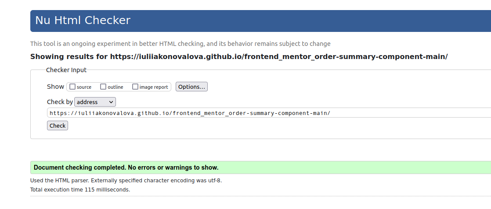
+ #### CSS
  
  - No errors or warnings were found when passing through the official [W3C (Jigsaw)](https://jigsaw.w3.org/css-validator/#validate_by_uri) validator: 

  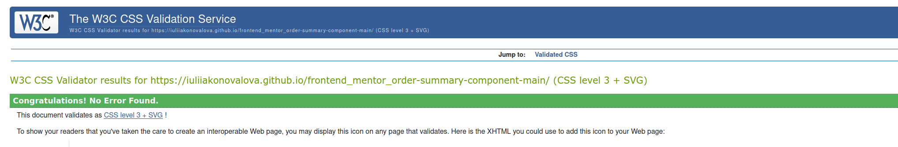

---

### Lighthouse Report

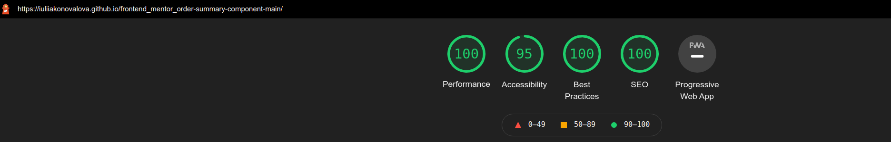

---

## Deployment

- The site was deployed to GitHub pages. The steps to deploy are as follows: 
  - In the [GitHub repository](https://github.com/IuliiaKonovalova/frontend_mentor_order-summary-component-main), navigate to the Settings tab 
  - From the source section drop-down menu, select the **Main** Branch, then click "Save".
  - The page will be automatically refreshed with a detailed ribbon display to indicate the successful deployment.

The live link can be found [here](https://iuliiakonovalova.github.io/frontend_mentor_order-summary-component-main/)

---

### Local Deployment

In order to make a local copy of this project, you can clone it.
In your IDE Terminal, type the following command to clone my repository:

- `git clone https://github.com/IuliiaKonovalova/frontend_mentor_order-summary-component-main.git`

---

## Author

- Website - [Iuliia Konovalova](https://github.com/IuliiaKonovalova)
- Frontend Mentor - [@IuliiaKonovalova](https://www.frontendmentor.io/profile/IuliiaKonovalova)

---

## Credits

+ ### Content and Design

  - [Frontend Mentor](https://www.frontendmentor.io) had provided all necessary content and design that was used in order to complete this challenge.
  - [Google Fonts](https://fonts.google.com/) was usd in order to implement required font.

---

## Acknowledgement

  - [Frontend Mentor](https://www.frontendmentor.io) for inspiring to improve my skills.

## Wireframes

- Desktop:

- Mobile:

- Active States:
